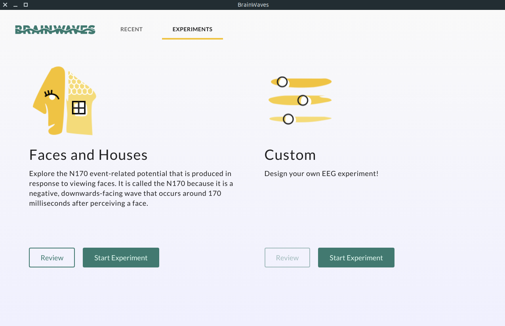

<p align="center">
  
</p>
<p align="center" href="">
  An easy-to-use platform for EEG experimentation in the classroom
</p>

## Features

- Design, run, and analyze an experiment using real EEG data all in one desktop
  app
- Investigate visual event-related brain waves (ERPs)
- Supports Emotiv Epoc+ and Muse devices

## Screenshots
<p align="center">
  
</p>

## Prerequisites

BrainWaves is an Electron app that can be installed natively on your system. However, because it makes use of the [MNE Python](https://martinos.org/mne/stable/index.html) library to perform EEG analysis, it is necessary to set up an appropriate Python environment to be able to analyze collected experimental results.

### Environment Setup

BrainWaves needs an Anaconda environment called "brainwaves" with the right
dependencies to run its analysis.

1. Download and install Anaconda for Python 3. We recommend using the
   [Miniconda installer for Python 3.6 available from this page](https://conda.io/miniconda.html)
https://github.com/makebrainwaves/BrainWaves
2. Download the BrainWaves
   [environment file](https://github.com/makebrainwaves/BrainWaves/releases/download/v0.8.1/environment.yml)
   or grab it by cloning this repository

_Note: you may need to install Microsoft Visual C++ Build Tools to run this
following command on Windows_

3. Open Anaconda prompt (or terminal on Linux and OSX) in the directory where
   the environment file is located and run `conda env create -f environment.yml`

4. If the environment is created successfully, run the following command to create a new jupyter kernel that uses this environment:
   `python -m ipykernel install --user --name brainwaves --display-name "brainwaves"`


## Download

- Windows:
  [click here](https://github.com/makebrainwaves/BrainWaves/releases/download/v0.8.1/BrainWaves.Setup.0.8.1.exe)
- MacOS: coming soon
- Linux (only supports Muse):
  [click here](https://github.com/makebrainwaves/BrainWaves/releases/download/v0.7.5/BrainWaves_0.7.4_amd64.deb)


## Installing from Source (for developers)

- Make sure you have node version >= 7, npm version >= 4 and have followed the [Environment Setup](https://github.com/makebrainwaves/BrainWaves#environment-setup) instructions

### OS X

- may need to update your `.bash_profile` to include the path for your
  [compiler](https://github.com/sandeepmistry/node-xpc-connection/issues/2)
  (nothing terribly scary).
  1. Find it's location
  ```bash
  which gcc
  ```
  2. Add this path to your `.bash_profile`
  ```bash
  export PATH="/usr/bin:$PATH"
  ```

### Windows 10

- [Visual C++ Build Tools](https://visualstudio.microsoft.com/thank-you-downloading-visual-studio/?sku=BuildTools&rel=15)


1. First, clone the repo via git:

```bash
git clone https://github.com/makebrainwaves/BrainWaves.git
```

2. And then install dependencies

```bash
$ cd BrainWaves
$ npm install
```

3. If using Emotiv, insert your Emotiv account's credentials into the file
   `keys.js`

### Run

Start the app in the `dev` environment. This starts the renderer process in
[**hot-module-replacement**](https://webpack.js.org/guides/hmr-react/) mode and
starts a webpack dev server that sends hot updates to the renderer process:

```bash
$ npm run dev
```

Alternatively, you can run the renderer and main processes separately. This way,
you can restart one process without waiting for the other. Run these two
commands **simultaneously** in different console tabs:

```bash
$ npm run start-renderer-dev
$ npm run start-main-dev
```

## Packaging

To package apps for the local platform:

```bash
$ npm run package
```

To package apps for all platforms:

First, refer to
[Multi Platform Build](https://www.electron.build/multi-platform-build) for
dependencies.

Then,

```bash
$ npm run package-all
```

To package apps with options:

```bash
$ npm run package -- --[option]
```

To run End-to-End Test

```bash
$ npm run build
$ npm run test-e2e
```

:bulb: You can debug your production build with devtools by simply setting the
`DEBUG_PROD` env variable:

```bash
DEBUG_PROD=true npm run package
```

## Contributing
if you are interested in fixing issues with the BrainWaves app or helping us add additional features, that's amazing! Please see our [How to Contribute](https://github.com/makebrainwaves/BrainWaves/blob/master/CONTRIBUTING.md).

Also, read our [Code of Conduct](https://github.com/makebrainwaves/BrainWaves/blob/master/CODE_OF_CONDUCT.md)


## License

[MIT](https://github.com/makebrainwaves/BrainWaves/blob/master/LICENSE)
