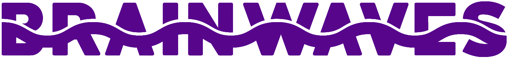
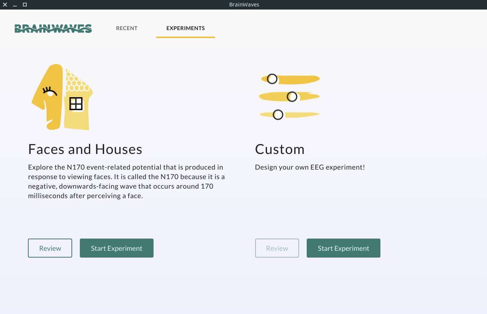

<p align="center">
  
</p>
<p align="center" href="">
  An easy-to-use platform for EEG experimentation in the classroom
</p>

## Features

- Design, run, and analyze an experiment using real EEG data all in one desktop
  app
- Investigate visual event-related brain waves (ERPs)
- Supports Emotiv Epoc+ and Muse devices

## Screenshots

<p align="center">
  
</p>

## Prerequisites

- **Node.js** >= 18
- **npm** >= 9
- No Python installation required — EEG analysis runs via [Pyodide](https://pyodide.org) (Python compiled to WebAssembly), which is downloaded automatically on first `npm install`.

> **Note:** `npm install` downloads ~300 MB of Pyodide WASM files on first run. This is expected and only happens once.

## Installing from Source (for developers)

1. Clone the repo:

```bash
git clone https://github.com/makebrainwaves/BrainWaves.git
cd BrainWaves
```

2. Install dependencies (this also installs Pyodide and patches certain deps):

```bash
npm install
```

### Development

Start the app with hot-reload using [electron-vite](https://electron-vite.org/):

```bash
npm run dev
```

### Testing

```bash
npm test           # run all Vitest tests once
npm run test:watch # run tests in watch mode
npm run test-all   # lint + typecheck + build + test (full CI check)
```

### Typecheck & Lint

```bash
npm run typecheck  # TypeScript type check (no emit)
npm run lint       # ESLint
npm run lint-fix   # ESLint + Prettier auto-fix
```

## Packaging

Build only (no installer):

```bash
npm run build
```

Package for the current platform:

```bash
npm run package
```

Package for specific platforms:

```bash
npm run package-mac    # macOS .dmg
npm run package-win    # Windows .exe (x64)
npm run package-linux  # Linux
npm run package-all    # all platforms (requires cross-platform build tools)
```

For cross-platform builds, see [electron-builder multi-platform docs](https://www.electron.build/multi-platform-build).

To debug a production build with DevTools:

```bash
DEBUG_PROD=true npm run package
```

## Contributing

if you are interested in fixing issues with the BrainWaves app or helping us add additional features, that's amazing! Please see our [How to Contribute](https://github.com/makebrainwaves/BrainWaves/blob/master/CONTRIBUTING.md).

Also, read our [Code of Conduct](https://github.com/makebrainwaves/BrainWaves/blob/master/CODE_OF_CONDUCT.md)

## License

[MIT](https://github.com/makebrainwaves/BrainWaves/blob/master/LICENSE)
