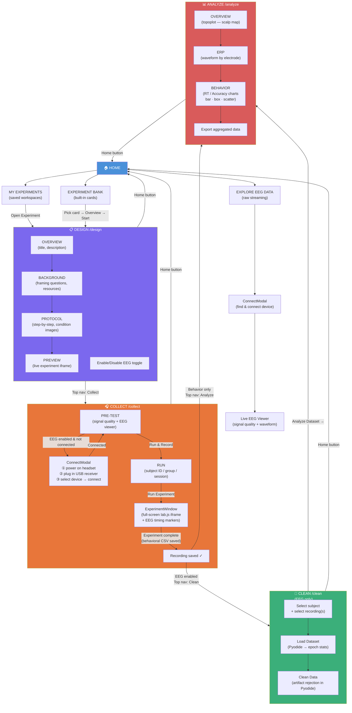

# BrainWaves User Flow

This document describes the user flow through the BrainWaves application — an Electron desktop app for conducting EEG neuroscience experiments.

## Flow Diagram

## Stage Descriptions

### 1. Home (`/` and `/home`)

Entry point with three tabs:

- **My Experiments** — table of previously saved workspaces; each row has Delete, Go to Folder, and Open Experiment actions.
- **Experiment Bank** — card grid of four built-in EEG paradigms: Faces/Houses (N170), Stroop Task, Multi-tasking, and Visual Search. Clicking a card opens an Overview panel before starting.
- **Explore EEG Data** — connects directly to a headset and streams live EEG without running a formal experiment.

### 2. Design (`/design`)

Four review tabs walk the researcher through the experiment before data collection:

| Tab | Content |
|---|---|
| **Overview** | Title and experiment description |
| **Background** | Framing questions and external reading resources |
| **Protocol** | Step-by-step instructions with condition images |
| **Preview** | Live experiment iframe (lab.js) |

An **Enable EEG** toggle controls whether the Clean step appears downstream. Custom experiments have additional tabs for configuring conditions, trials, timing parameters, and instructions.

### 3. Collect (`/collect`)

Two sub-views:

- **Pre-Test** — walks the user through `ConnectModal` (power on headset → plug in USB receiver → select device → connect), then shows live signal quality and a real-time EEG waveform.
- **Run** — collects subject ID, group name, and session number, then launches the experiment in a full-screen iframe. EEG timing markers are injected during the task. On completion, the behavioral CSV is saved automatically.

### 4. Clean (`/clean`) — EEG only

Shown only when EEG is enabled.

1. Select a subject and one or more recordings.
2. **Load Dataset** — loads epochs into Pyodide (Python-in-browser) and returns epoch statistics.
3. **Clean Data** — runs artifact rejection via Pyodide. Once the drop percentage reaches a threshold, the *Analyze Dataset* button becomes available.

### 5. Analyze (`/analyze`)

- **EEG mode** — three tabs: topoplot (scalp map overview), ERP waveforms per electrode, and behavioral analysis.
- **Behavior-only mode** — one tab: interactive bar, box, or scatter plots for response time or accuracy, with an outlier-removal option and an export button.
