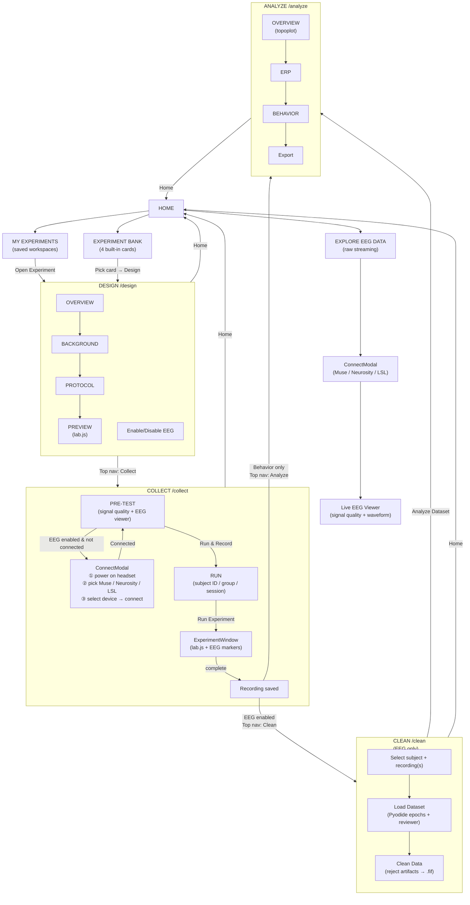

# BrainWaves User Flow

User flow through the BrainWaves Electron app. If this disagrees with the running code, the code wins — update this file.

## Flow Diagram

```mermaid
flowchart TD
    HOME["HOME"]
    HOME --> MY_EXP["MY EXPERIMENTS\n(saved workspaces)"]
    HOME --> EXP_BANK["EXPERIMENT BANK\n(4 built-in cards)"]
    HOME --> EXPLORE["EXPLORE EEG DATA\n(raw streaming)"]

    MY_EXP -->|"Open Experiment"| DESIGN
    EXP_BANK -->|"Pick card → Design"| DESIGN

    EXPLORE --> CONNECT_MODAL_EXP["ConnectModal\n(Muse / Neurosity / LSL)"]
    CONNECT_MODAL_EXP --> EEG_EXPLORE["Live EEG Viewer\n(signal quality + waveform)"]

    subgraph DESIGN ["DESIGN  /design"]
        direction TB
        D_OV["OVERVIEW"]
        D_BG["BACKGROUND"]
        D_PR["PROTOCOL"]
        D_PV["PREVIEW\n(lab.js)"]
        D_OV --> D_BG --> D_PR --> D_PV
        EEG_TOGGLE["Enable/Disable EEG"]
    end

    DESIGN -->|"Top nav: Collect"| COLLECT

    subgraph COLLECT ["COLLECT  /collect"]
        direction TB
        PRE_TEST["PRE-TEST\n(signal quality + EEG viewer)"]
        CONNECT_MODAL["ConnectModal\n① power on headset\n② pick Muse / Neurosity / LSL\n③ select device → connect"]
        PRE_TEST -->|"EEG enabled & not connected"| CONNECT_MODAL
        CONNECT_MODAL -->|"Connected"| PRE_TEST
        PRE_TEST -->|"Run & Record"| RUN
        RUN["RUN\n(subject ID / group / session)"]
        EXP_WINDOW["ExperimentWindow\n(lab.js + EEG markers)"]
        RUN -->|"Run Experiment"| EXP_WINDOW
        EXP_WINDOW -->|"complete"| DONE_COLLECT["Recording saved"]
    end

    DONE_COLLECT -->|"EEG enabled\nTop nav: Clean"| CLEAN
    DONE_COLLECT -->|"Behavior only\nTop nav: Analyze"| ANALYZE

    subgraph CLEAN ["CLEAN  /clean\n(EEG only)"]
        direction TB
        CL_SEL["Select subject + recording(s)"]
        CL_LOAD["Load Dataset\n(Pyodide epochs + reviewer)"]
        CL_CLEAN["Clean Data\n(reject artifacts → .fif)"]
        CL_SEL --> CL_LOAD --> CL_CLEAN
    end

    CLEAN -->|"Analyze Dataset"| ANALYZE

    subgraph ANALYZE ["ANALYZE  /analyze"]
        direction TB
        AN_OV["OVERVIEW\n(topoplot)"]
        AN_ERP["ERP"]
        AN_BEH["BEHAVIOR"]
        AN_EXP["Export"]
        AN_OV --> AN_ERP --> AN_BEH --> AN_EXP
    end

    DESIGN -->|"Home"| HOME
    COLLECT -->|"Home"| HOME
    CLEAN -->|"Home"| HOME
    ANALYZE -->|"Home"| HOME
```

## Stage Descriptions

### 1. Home (`/` and `/home`)

Three tabs:

- **My Experiments** — saved workspaces; Delete, Go to Folder, Open Experiment.
- **Experiment Bank** — five cards: Faces/Houses (N170), Stroop, Multi-tasking, Visual Search, and **Custom**. Built-in cards start a workspace and go to Design. Custom opens a title prompt, then Design with extra authoring tabs.
- **Explore EEG Data** — connect a headset and stream live EEG with no experiment.

### 2. Design (`/design`)

| Tab | Content |
|---|---|
| **Overview** | Title and experiment description |
| **Background** | Framing questions and external reading |
| **Protocol** | Step-by-step instructions with condition images |
| **Preview** | Live lab.js preview |

**Enable EEG** (gear / toggle) controls whether Clean appears downstream.

Custom experiments add Conditions / Trials / Parameters / Instructions. Pick 1–4 image folders and key responses; the first image of each condition is a practice trial. Runtime is the Faces/Houses lab.js template parameterized by those stimuli (`filepath` URLs). `experiments/custom/experiment.js` is kept on disk but is not the runtime (it still uses the pre-Vite `this.files[dir/filename]` lookup).

### 3. Collect (`/collect`)

- **Pre-Test** — `ConnectModal` (headset on → pick **Muse**, **Neurosity Crown**, or **External LSL stream** if liblsl loaded → connect), then signal quality + live waveform. Muse/Neurosity are Web Bluetooth. There is no USB receiver (that was Emotiv).
- **Run** — subject ID, group, session → full-screen lab.js. Markers go through `injectMarker()` (active BLE driver) and, when LSL is available, `sendMarker()` to the outlet. Behavioral CSV is saved on end.

### 4. Clean (`/clean`) — EEG only

Shown when EEG is enabled.

1. Select a subject and one or more recordings.
2. **Load Dataset** — Pyodide epochs + interactive `EpochReviewer` / `LiveErpPane`.
3. **Clean Data** — reject artifacts, write `.fif`. **Analyze Dataset** is available once `epochsInfo` exists; it is not gated on a drop-percentage threshold.

### 5. Analyze (`/analyze`)

- **EEG mode** — topoplot (Pyodide/matplotlib SVG), ERP waveforms, behavioral plots (Plotly).
- **Behavior-only mode** — RT / accuracy (bar, box, scatter), outlier removal, export.
