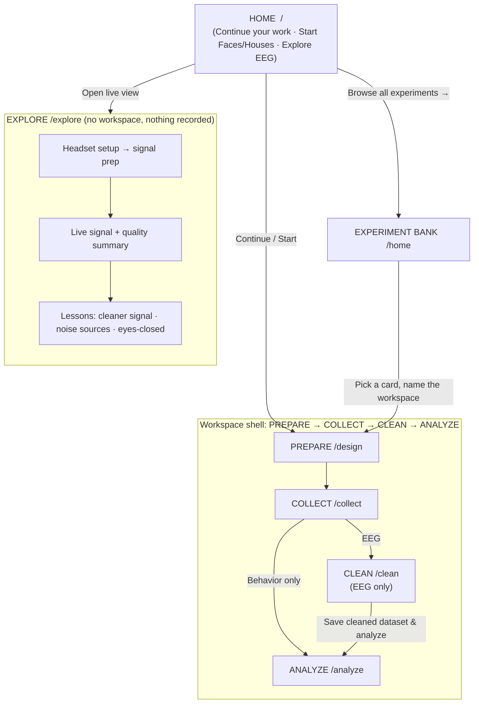

# BrainWaves User Flow

User flow through the BrainWaves Electron app. If this disagrees with the running code, the code wins — update this file.

## Flow Diagram

```mermaid
flowchart TD
    HOME["HOME  /\n(Continue your work · Start Faces/Houses · Explore EEG)"]
    HOME -->|"Browse all experiments →"| BANK["EXPERIMENT BANK  /home"]
    HOME -->|"Open live view"| EXPLORE
    HOME -->|"Continue / Start"| PREPARE
    BANK -->|"Pick a card, name the workspace"| PREPARE

    subgraph EXPLORE ["EXPLORE  /explore (no workspace, nothing recorded)"]
        direction TB
        EX_SETUP["Headset setup → signal prep"]
        EX_LIVE["Live signal + quality summary"]
        EX_LESSONS["Lessons: cleaner signal · noise sources · eyes-closed"]
        EX_SETUP --> EX_LIVE --> EX_LESSONS
    end

    subgraph SHELL ["Workspace shell: PREPARE → COLLECT → CLEAN → ANALYZE"]
        direction LR
        PREPARE["PREPARE  /design"]
        COLLECT["COLLECT  /collect"]
        CLEAN["CLEAN  /clean\n(EEG only)"]
        ANALYZE["ANALYZE  /analyze"]
        PREPARE --> COLLECT
        COLLECT -->|"EEG"| CLEAN
        COLLECT -->|"Behavior only"| ANALYZE
        CLEAN -->|"Save cleaned dataset & analyze"| ANALYZE
    end
```

The shell bar shows the current area (gold underline), one recommended `NEXT →`, and truthful data badges (`N recordings`, `N cleaned`). Any area can be opened; Clean and Analyze explain what they need when there is no data. During a recorded run the bar is replaced by the RunBar (`EEG recording` / `Behavior only`, elapsed time, `End experiment early`).

## Stage Descriptions

### 1. Home (`/`), Experiment Bank (`/home`)

- **Home** — `Welcome back` (or `Welcome to BrainWaves` on first run): Continue your work (saved workspaces, newest first, with Open, Show in folder and a confirmed Delete), Start Faces/Houses (the recommended first experiment; a naming dialog suggests the next free name), and Explore EEG.
- **Experiment Bank** — Faces/Houses (N170), Stroop, Multi-tasking, Visual Search, Custom, and imported jsPsych / lab.js studies. Built-in cards start a uniquely named workspace and open Prepare.

### 2. Prepare (`/design`)

Built-in experiments show `PrepareSteps`: **Overview → Background → Protocol → Preview**, each with one forward action. Protocol shows the condition cards, keycaps and a flow diagram with the experiment's real trial counts. Preview runs the participant screens in a labelled preview box. Nothing here gates Collect.

Settings → EEG on/off controls whether Clean appears downstream.

Custom experiments keep their authoring steps (Overview, Conditions, Trials, Parameters, Instructions, Preview); imported studies show Overview, Markers and Preview. Custom: pick 1–4 image folders and key responses; the first image of each condition is a practice trial. Runtime is the Faces/Houses lab.js template parameterized by those stimuli (`filepath` URLs). `experiments/custom/experiment.js` is kept on disk but is not the runtime (it still uses the pre-Vite `this.files[dir/filename]` lookup).

### 3. Collect (`/collect`)

- **Pre-Test** — headset setup opens when EEG is on and nothing is connected (also from the shell's device chip, whose Connected screen offers Disconnect): pick **Muse**, **Neurosity Crown**, or an **LSL stream** if liblsl loaded → wear/power-on tips → `Find my headset` (the only thing that starts a search; it ends when a headset is found, the student cancels, or after one minute: "Is your Muse turned on?") → connect → `Check my signal` → signal prep → the pre-run screen with signal quality, the live waveform and the Ready-to-run card. Muse and Neurosity use Web Bluetooth.
- **Run** — subject ID, group, session (a taken session is never overwritten) → SPACE to begin → BrainWaves instruction, practice and main-task screens → end screen. `End experiment early` or a held Escape ends the run with no confirm and keeps what was recorded as `*.incomplete.csv`, which Clean and Analyze leave out. Markers go through `injectMarker()` (active BLE driver) and, when LSL is available, `sendMarker()` to the outlet.

### Explore (`/explore`) — no workspace

Connect a headset and watch the live signal. The quality summary names the action (Ready / Settling / Adjust sensors / No signal) beside the head diagram and sensor card. Three activities: **How do I get a cleaner signal?** (3 tips), **Where is this noise coming from?** (blink steps: noise defined, blink bands, a prediction, several blinks, then paused calm-vs-blinking strips), and the **eyes-closed activity** (a countdown and chimes mark ten seconds eyes closed; the review compares paused eyes-open and eyes-closed segments). Nothing is recorded.

### 4. Clean (`/clean`) — EEG only

Shown when EEG is enabled.

Pick **one** complete raw recording (ended-early recordings stay hidden until revealed, and can only be deleted to the Trash) → review its trials in `EpochReviewer` / `LiveErpPane` → leave out trials, flag sensors, and **Accept** or **Restore** each auto-flag suggestion (nothing is applied automatically) → **Apply exclusions** saves in place, and **Save cleaned dataset & analyze** always saves before opening Analyze.

### 5. Analyze (`/analyze`)

Tabs follow the EEG toggle:
- **Overview** (EEG): cleaned-recording checklist, an "Included" summary, and PSD and topography side by side.
- **ERP** (EEG): head-diagram sensor picker, the MNE ERP figure, and the "Walk me through it" walkthrough, drawn from the cleaned epochs.
- **Behavior** (always): response time or accuracy as bars, dots or box plots, outlier removal, and summary CSV export.

EEG tabs show "Clean first" until a cleaned recording exists. Behavior never gates.
